# Fraud Detection for E-Commerce and Bank Transactions

### Final Project Report — Process & Outcomes

**Project:** Improved detection of fraud cases for e-commerce and bank transactions
**Organization:** Adey Innovations Inc.
**Program:** 10 Academy — Week 5 & 6 challenge
**Repository:** https://github.com/kalkidantad/Fraud-Detection

---

## Executive summary

Adey Innovations needs to catch fraudulent transactions across two very
different channels — an **e-commerce** store and a **bank card** processor.
Fraud is rare in both (≈9.4% and ≈0.17% of transactions), so the project is a
classic **imbalanced classification** problem where naïve accuracy is
meaningless.

We built two independent, leakage-free pipelines, compared an interpretable
baseline (Logistic Regression) against a gradient-boosted ensemble (XGBoost),
and selected **XGBoost** for both datasets on the strength of **AUC-PR** and
**F1**. We then opened the black box with **SHAP** to understand *why* the
models predict fraud and translated those insights into concrete business
actions.

**Headline outcomes**

| Dataset | Best model | AUC-PR | F1 | Precision | Recall |
| --- | --- | ---: | ---: | ---: | ---: |
| E-commerce | XGBoost | **0.7087** | **0.6174** | 0.5670 | 0.6777 |
| Credit card | XGBoost | **0.8287** | **0.8671** | 0.9615 | 0.7895 |

**Top fraud drivers (from SHAP)**

- **E-commerce:** `device_txn_count` (shared-device velocity) and
  `time_since_signup` (buying moments after signup) dominate.
- **Credit card:** anonymised PCA components `V14`, `V4`, `V12`, `V10`, `V3`.

These directly motivate the recommendations in §6: step-up verification right
after signup, throttling shared devices, and a real-time anomaly score on the
top card components.

---

## 1. Problem framing & methodology (the "process")

### 1.1 Two separate problems

| Dataset | Rows | Fraud rate | Feature style |
| --- | ---: | ---: | --- |
| `Fraud_Data.csv` (e-commerce) | 151,112 | 9.36% (14,151 / 151,112) | Behavioural + identity + geo |
| `creditcard.csv` (bank) | 283,726 (deduped) | 0.17% (473 / 283,726) | Anonymised PCA `V1..V28`, `Amount`, `Time` |

The two datasets have **different feature structures**, so they are treated as
**independent modeling problems** with their own pipelines — features are never
shared between them.

### 1.2 Guiding principles

1. **Front-load EDA and feature engineering** (Task 1) so modeling and SHAP
   (Tasks 2–3) are unobstructed.
2. **Resample the training set only.** SMOTE lives *inside* an imbalanced-learn
   `Pipeline`, so it only ever sees training folds — never validation/test.
3. **AUC-PR and F1 are the primary metrics**; accuracy is reported only to show
   why it is misleading.
4. **Document the reasoning at every step** — every design choice below is
   justified, not just stated.

### 1.3 Tooling & reproducibility

- Code is modular under `src/` and orchestrated by three notebooks
  (`notebooks/01..03`).
- All randomness is seeded (`config.RANDOM_STATE = 42`), so the train/test split
  — and therefore the specific transactions explained by SHAP — are
  reproducible.

```bash
python -m venv .venv && source .venv/bin/activate
pip install -r requirements.txt
python -m src.pipeline                                                       # Task 1 -> data/processed/
jupyter nbconvert --to notebook --execute notebooks/02_model_building.ipynb  # Task 2 -> models/
python -m src.explainability                                                 # Task 3 -> reports/figures/
```

---

## 2. Task 1 — Data analysis & feature engineering

### 2.1 Cleaning (process)

Implemented in `src/preprocessing.py` and `src/data_loader.py`:

- Parsed `signup_time` / `purchase_time` to `datetime`; coerced IP bounds to
  integers.
- Dropped exact duplicate rows (notably relevant for the card data).
- Imputed missing **numeric** values with the **median** (robust to the
  heavy-tailed `purchase_value`) and **categoricals** with the **mode**; any
  column >50% missing would be dropped.

### 2.2 Class imbalance (outcome)

Both targets are severely imbalanced — the core challenge of the project.

| E-commerce | Credit card |
| --- | --- |
| 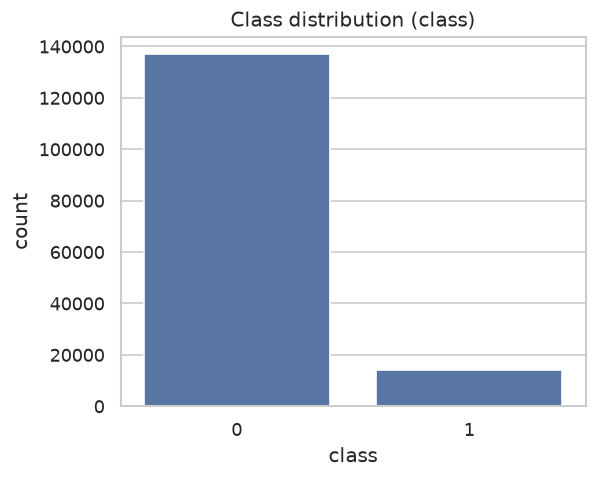 | 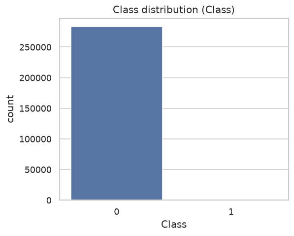 |

E-commerce fraud is ~1-in-10; card fraud is ~1-in-580. This is *why* we lead
with AUC-PR/F1 rather than accuracy.

### 2.3 IP → country geolocation (process)

Implemented in `src/geolocation.py`. The numeric `ip_address` is matched to
`[lower, upper]` country ranges using a sorted **`merge_asof`** (backward
search) followed by upper-bound validation — `O((n+m) log m)` instead of an
`O(n·m)` cross-join. IPs outside all ranges are labelled `Unknown`.

### 2.4 Engineered features (process + rationale)

Implemented in `src/feature_engineering.py`:

| Feature | Rationale |
| --- | --- |
| `time_since_signup` (hours) | Fraud accounts buy almost immediately after signup. |
| `purchase_hour`, `purchase_dayofweek` | Diurnal / weekly fraud patterns. |
| `user_txn_count`, `device_txn_count` | Velocity — reuse across many transactions. |
| `device_shared` | Multiple accounts on one device = fraud-ring tell. |

### 2.5 EDA outcomes

The engineered `time_since_signup` is the standout signal: fraudulent
transactions (orange) pile up at near-zero hours, while legitimate purchases
are spread across time.

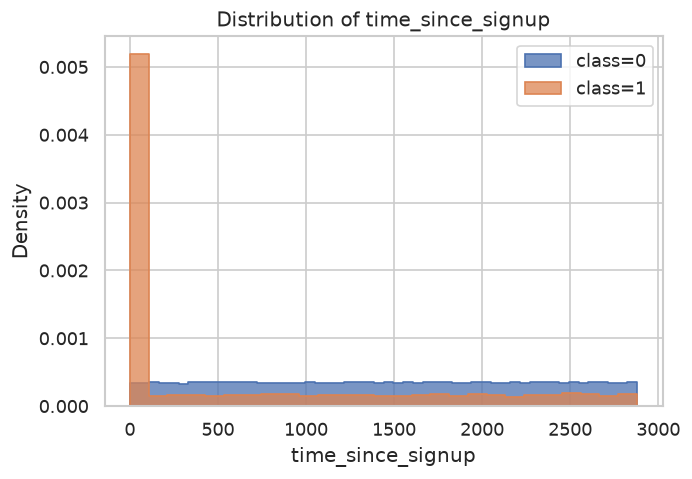

Raw `purchase_value` overlaps heavily between classes (weak separator on its
own), and fraud rate varies by acquisition `source` and `browser`:

| Purchase value by class | Fraud rate by source |
| --- | --- |
| 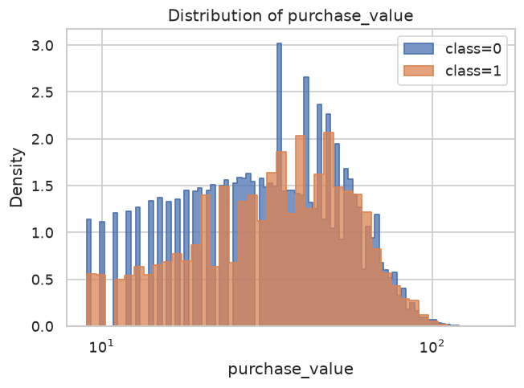 | 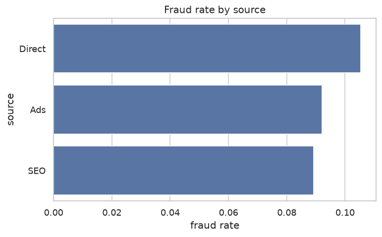 |

Correlation among numeric features (e-commerce) confirms the engineered
features add signal beyond the raw columns:

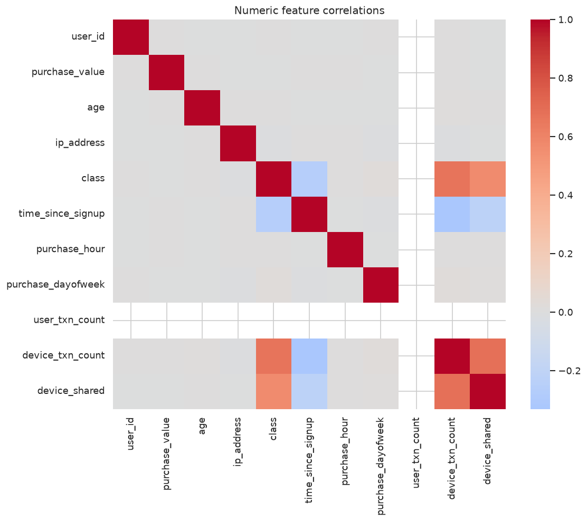

### 2.6 Encoding, scaling & leakage control

- **One-hot** for `source`, `browser`, `sex`, `country` (`min_frequency=0.01`
  collapses rare countries; unknown categories ignored at inference).
- **StandardScaler** on numeric features.
- The `ColumnTransformer` is fit on the **training split only** — no leakage.

**Artifacts:** `data/processed/fraud_processed.csv`,
`data/processed/creditcard_processed.csv`. Full write-up:
`reports/interim_1_report.md`.

---

## 3. Task 2 — Model building, evaluation & selection

### 3.1 Process

- **Stratified 80/20 split** preserves the fraud ratio in both folds
  (`transform.stratified_split`).
- **Leakage control:** preprocessing + **SMOTE** are wrapped in an
  imbalanced-learn `Pipeline`, so the scaler is fit and SMOTE resamples on the
  **training fold only** (`src/modeling.py`).
- Two models per dataset:
  - **Logistic Regression** — interpretable baseline, `class_weight="balanced"`
    + SMOTE.
  - **XGBoost** — ensemble, `scale_pos_weight = neg/pos`, `eval_metric="aucpr"`.
- **Metrics:** AUC-PR (primary), F1, precision, recall, ROC-AUC, confusion
  matrix (`src/evaluation.py`).

### 3.2 Results (outcome)

**E-commerce (`Fraud_Data`)**

| Model | AUC-PR | ROC-AUC | F1 | Precision | Recall |
| --- | ---: | ---: | ---: | ---: | ---: |
| Logistic Regression | 0.6651 | 0.8375 | 0.6014 | 0.5194 | 0.7141 |
| **XGBoost** | **0.7087** | **0.8404** | **0.6174** | **0.5670** | 0.6777 |

**Credit card (`creditcard`)**

| Model | AUC-PR | ROC-AUC | F1 | Precision | Recall |
| --- | ---: | ---: | ---: | ---: | ---: |
| Logistic Regression | 0.6750 | 0.9626 | 0.1000 | 0.0530 | 0.8737 |
| **XGBoost** | **0.8287** | **0.9773** | **0.8671** | **0.9615** | 0.7895 |

Precision-recall curves and confusion matrices:

| PR — e-commerce | PR — credit card |
| --- | --- |
| 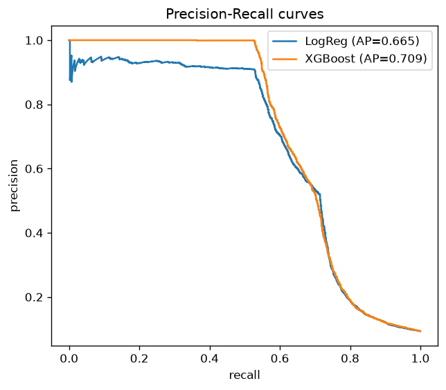 | 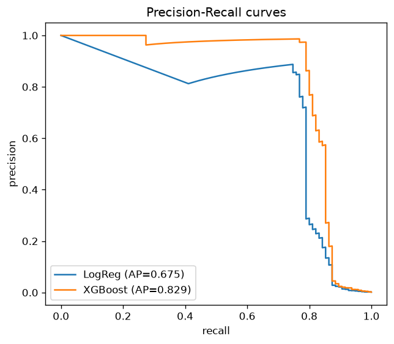 |

| Confusion — XGBoost e-commerce | Confusion — XGBoost credit card |
| --- | --- |
| 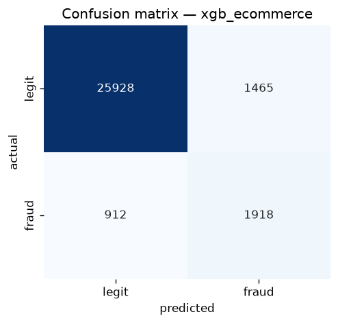 | 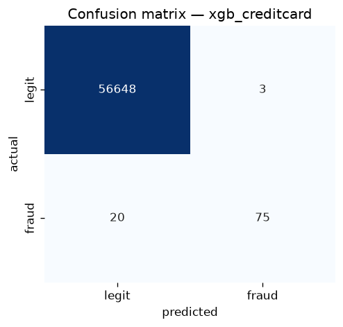 |

### 3.3 Model selection & justification

**XGBoost is selected for both datasets.** It wins on AUC-PR and F1 everywhere.
The credit-card gap is decisive: Logistic Regression catches 87% of fraud but at
**5.3% precision** (F1 = 0.10) — it would flood analysts with false alarms —
whereas XGBoost reaches **0.96 precision at 0.79 recall** (F1 = 0.87), the only
operationally usable model on the ~0.17% imbalance. ROC-AUC looks high for every
model on the card data, which is exactly why we lead with AUC-PR: it is the
metric that actually separates the two models.

Fitted pipelines are serialized to `models/xgb_ecommerce.joblib` and
`models/xgb_creditcard.joblib`. Full write-up: `reports/interim_2_report.md`.

---

## 4. Task 3 — Model explainability (SHAP)

### 4.1 Process

We interpret the selected XGBoost models with two complementary lenses:

- **Built-in (gain) importance** — which features the trees split on.
- **Exact tree-SHAP** — how much, and in which direction, each feature moves
  each prediction.

SHAP runs on the **held-out test split** (same `random_state=42` split as Task
2). Because the model is a pipeline, SHAP operates on the **transformed** design
matrix; force-plot feature values are therefore in scaled units (a negative
`time_since_signup` = shorter-than-average gap). Code: `src/explainability.py`.

### 4.2 Global importance — e-commerce (outcome)

| Built-in (gain) | SHAP (beeswarm) |
| --- | --- |
| 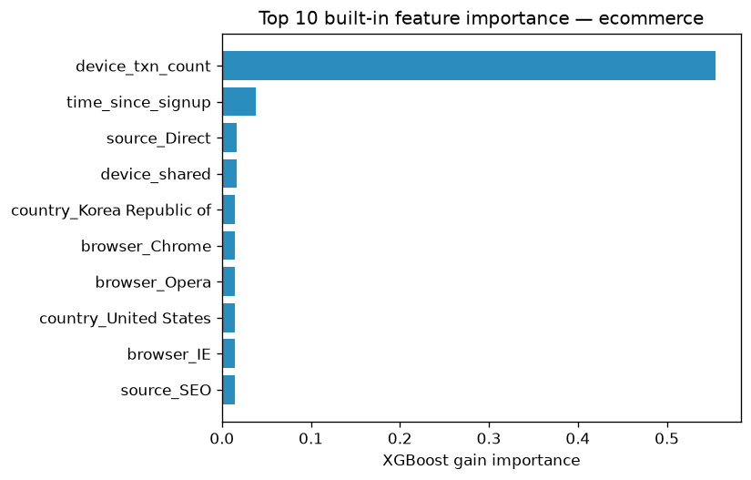 | 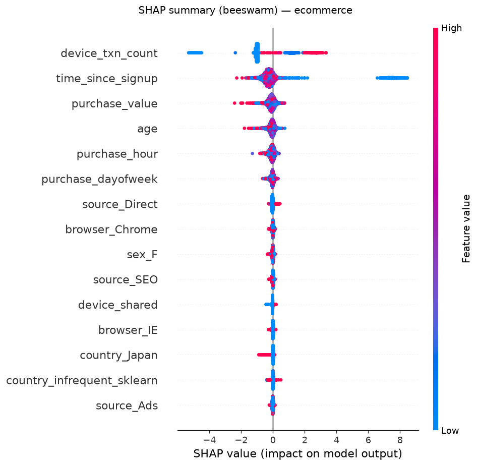 |

Top-5 SHAP drivers: `device_txn_count` (1.122), `time_since_signup` (0.673),
`purchase_value` (0.172), `age` (0.141), `purchase_hour` (0.128). High
`device_txn_count` and *short* `time_since_signup` both push hard toward fraud.

### 4.3 Global importance — credit card (outcome)

| Built-in (gain) | SHAP (beeswarm) |
| --- | --- |
| 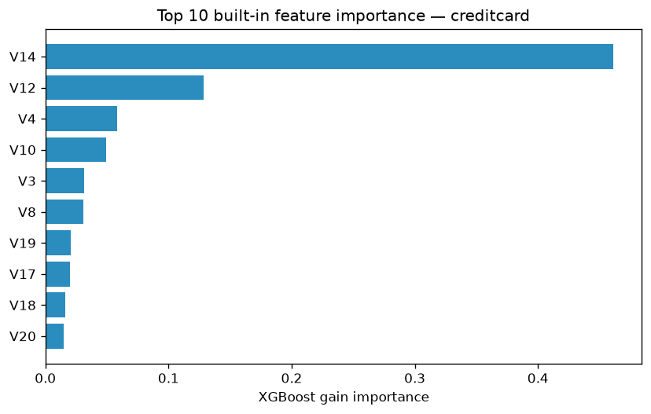 | 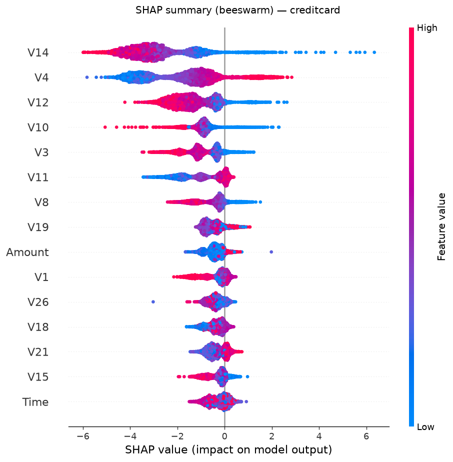 |

Top-5 SHAP drivers: `V14` (2.907), `V4` (1.999), `V12` (1.442), `V10` (0.973),
`V3` (0.960). Fraud concentrates in the extreme tails of a few PCA components;
`Amount` also reaches the SHAP top-10.

### 4.4 Local explanations (force plots)

**E-commerce**

| True positive | False positive | False negative |
| --- | --- | --- |
| 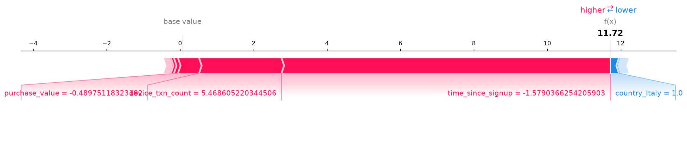 | 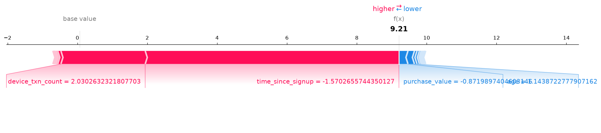 | 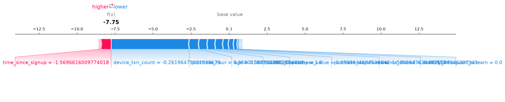 |

- **TP (prob 1.000):** short signup gap + high device count → confident catch.
- **FP (prob 0.9999):** a legitimate buyer on a *shared* device who bought
  quickly — the two strongest fraud features both fire, so the model
  over-commits.
- **FN (prob 0.0004):** real fraud the model missed; only signup-recency flagged
  it while the (non-shared) device and everything else looked normal.

**Credit card**

| True positive | False positive | False negative |
| --- | --- | --- |
| 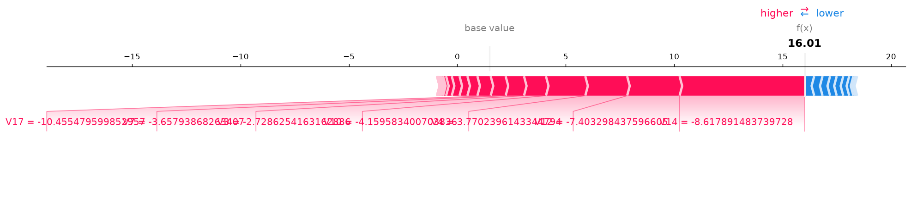 | 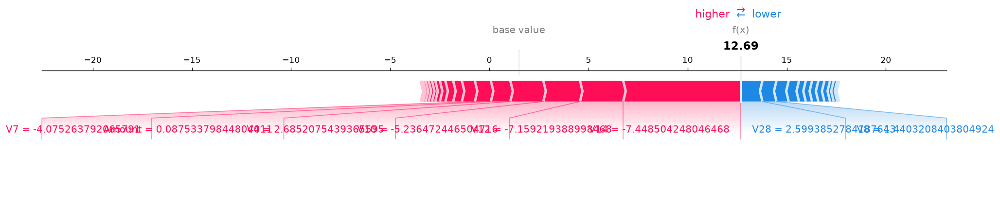 | 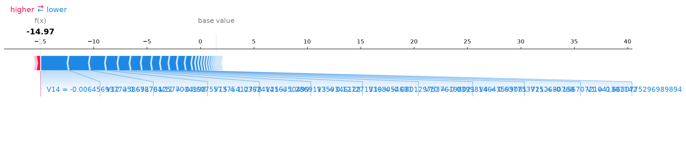 |

### 4.5 SHAP vs built-in importance

Both methods agree on the dominant features (`device_txn_count` /
`time_since_signup`; `V14`/`V12`/`V4`/`V10`/`V3`). They diverge below the top:
gain importance over-credits sparse one-hot categoricals (browsers, countries),
while SHAP correctly elevates the continuous behavioural features
(`purchase_value`, `age`, `purchase_hour`) and `Amount`. We trust SHAP's
contribution-based ranking for decisions.

### 4.6 Surprising findings

- **The e-commerce model is essentially a velocity detector** —
  `device_txn_count` alone is ~56% of gain. Powerful but fragile: rotate devices
  and you evade it (exactly the false negative above).
- **`time_since_signup` acts as a hard threshold, not a smooth trend** — short
  gaps form an isolated high-fraud cluster in the beeswarm.
- **Built-in importance can mislead** (high-cardinality bias) — business
  decisions should be driven by SHAP.

Full write-up: `reports/interim_3_report.md`.

---

## 5. Top 5 fraud drivers (combined)

**E-commerce:** 1) `device_txn_count` 2) `time_since_signup` 3) `purchase_value`
4) `age` 5) `purchase_hour`.

**Credit card:** 1) `V14` 2) `V4` 3) `V12` 4) `V10` 5) `V3`.

---

## 6. Business recommendations

Each recommendation is tied to a specific SHAP insight.

1. **Step-up verification for purchases shortly after signup.**
   *Evidence:* `time_since_signup` is the #2 driver and low values form a
   dedicated high-fraud cluster. *Action:* require OTP / 3-D Secure for any
   purchase within ~1 hour of account creation.

2. **Monitor and rate-limit devices shared across many accounts.**
   *Evidence:* `device_txn_count` is the #1 driver. *Action:* throttle and route
   to review any `device_id` linked to many accounts — paired with rule 1 to
   avoid false positives on legitimate shared devices.

3. **Deploy a real-time anomaly score on `V14/V4/V12/V10/V3`** for card
   transactions; auto-hold extreme cases and route borderline ones to manual
   review.

4. **Close the velocity blind spot (model improvement).**
   *Evidence:* the false negative was missed because only signup-recency fired.
   *Action:* add IP-velocity, billing/shipping mismatch and email-domain-age
   features so detection degrades gracefully when fraudsters rotate devices.

5. **Treat `Amount` as an explicit risk input** for cards (top-10 by SHAP
   despite low gain rank); combine it with the anomaly score.

---

## 7. Limitations & future work

- **Feature drift:** velocity/recency signals can be gamed; periodic retraining
  and the additional features in recommendation 4 mitigate this.
- **Threshold tuning:** metrics use the default 0.5 cut-off; in production the
  threshold should be tuned to the business cost ratio of false positives vs
  missed fraud.
- **Anonymised card features:** `V1..V28` are PCA components, so SHAP describes
  behaviour (anomaly axes) rather than human-readable causes.
- **Temporal validation:** a time-based split would better simulate deployment
  than the random stratified split used here.

---

## 8. Deliverables & reproducibility

| Deliverable | Location |
| --- | --- |
| Reusable pipeline code | `src/` (`data_loader`, `preprocessing`, `geolocation`, `feature_engineering`, `transform`, `eda`, `modeling`, `evaluation`, `explainability`, `pipeline`) |
| Notebooks | `notebooks/01_data_analysis_preprocessing.ipynb`, `02_model_building.ipynb`, `03_model_explainability.ipynb` |
| Trained models | `models/xgb_ecommerce.joblib`, `models/xgb_creditcard.joblib` |
| Figures | `reports/figures/` (EDA, PR curves, confusion matrices, importance, SHAP) |
| Task reports | `reports/interim_1_report.md`, `interim_2_report.md`, `interim_3_report.md` |
| This report | `reports/final_report.md` |

All randomness is seeded (`config.RANDOM_STATE = 42`); the commands in §1.3
regenerate every artifact end-to-end.
